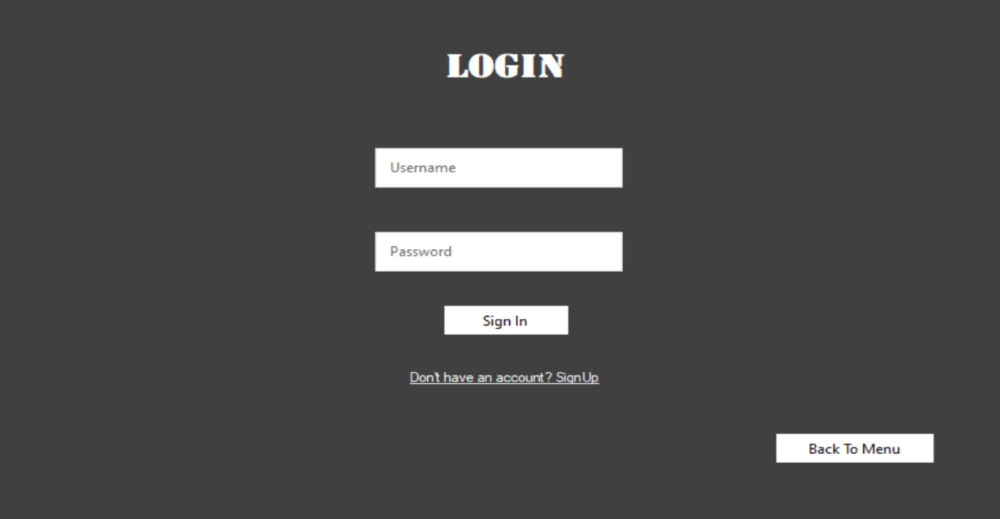
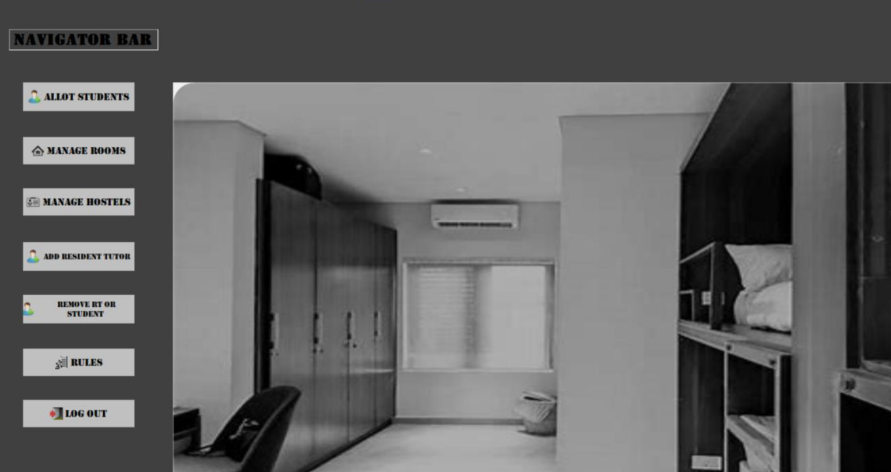
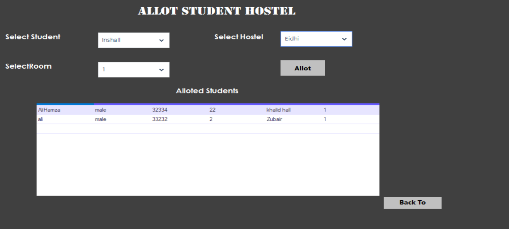
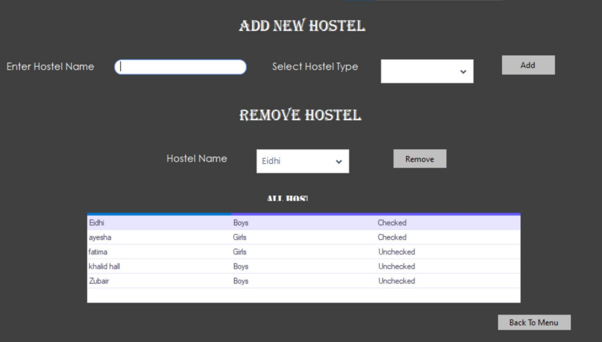

# Five Star Hostel

A Windows Form hostel management system developed in C# with MS SQL Server integration, implementing object-oriented programming principles. This user-friendly platform features distinct logins for students, resident tutors, and senior wardens. Students can manage profiles, request leave, and submit complaints, while resident tutors oversee hostel operations and senior wardens ensure efficient coordination across all hostels.

## Table of Contents
- [Features](#features)
- [Screenshots](#screenshots)
- [Documentation](#documentation)
- [Technologies Used](#technologies-used)
- [Usage](#usage)
- [Contributing](#contributing)

## Features
- 3 tier model - Business layer, Data layer and User Interface
- Backend business logic and data handling separated into a DLL framework, making it reusable and flexible for future UI developments
- Distinct login system for students, resident tutors, and senior wardens
- Students can manage their profiles and submit complaints
- Resident tutors and senior wardens can oversee operations and manage student requests
- A clean and modern interface that works well on various devices

## Screenshots

## Documentation
For a detailed overview of the project and its features, visit the [Documentation](./documentation/) in the repository.

## Technologies Used
- C#
- Windows Forms
- MSSQL Database
  
## Usage
1. Clone the repository:
   `git clone https://github.com/miansaadtahir/fivestarhostel.git`
2. Navigate to the project directory:
   `cd .\HostelUI\Resistay\bin\debug`
3. Launch the `Resistay.exe` file

## Contributing
Contributions, issues, and feature requests are welcome!  
Feel free to check out the [issues page](https://github.com/miansaadtahir/fivestarhostel/issues) for more information.
